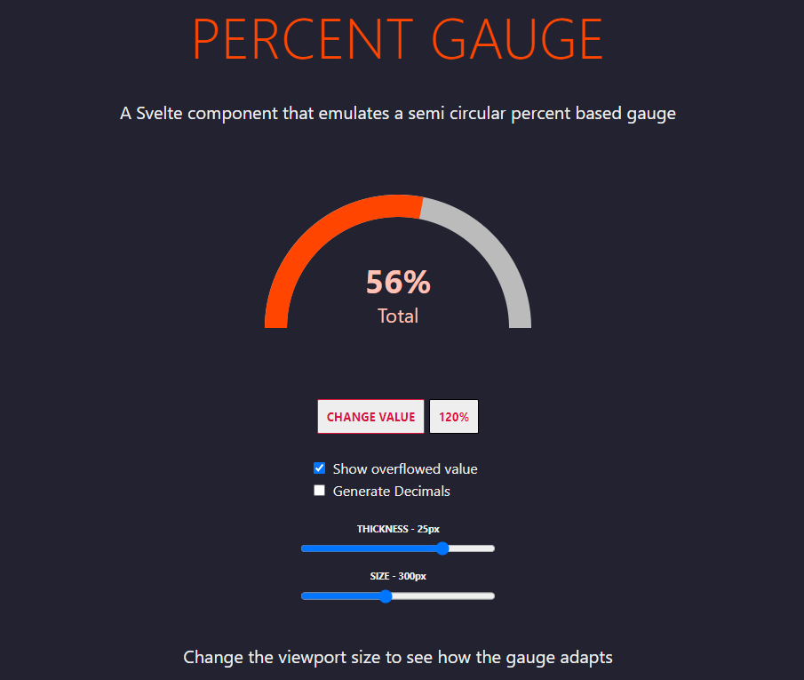

# Percent Gauge

### A Svelte component that creates a semi circular percent based gauge

This component uses only CSS to generate an animated semi circle percent based gauge. It will show the percentage digits within the arc of the semi circle together with an optional very short description. It will resize to it's parent container width and set it's height to half that width. You can pick the colors, the short text description and, of course the value between 0 - 100. The percentage display and optional text below will be resized as needed.





[CHECK OUT THE ONLINE DEMO](https://wstaeblein.github.io/percentgauge/)

## Usage

```html
<script>
    import Percentgauge from './percentgauge.svelte';
    let val = 0;
    let options = {
        thickness: 12,
        legend: 'Total',
        color: 'orangered',
        bgColor: '#bbb',
        valueOverflow: true,
        textColor: '#ffc0b5'
    };
</script>

<main>
    <div>
        <Percentgauge value={val} bind:options={options}></Percentgauge>         
    </div>
</main>

<style>
    div {
        display: flex;
        justify-content: center;
        align-items: center;
        width: 300px;
        height: 150px;
    }
    main {
        text-align: center;
        padding: 1em;
        max-width: 400px;
        margin: 0 auto;
    }
</style>

```
There are a few properties you can pass to this component:

| Name | Description | Type | Default | 
|---|---|:---:|:---:|
| value | Defines the progress color | Integer | 0 |
| options | Object containing varios configurations | Object |  |
| options.color | Sets the gauge's track color | HTML Color String | red |
| options.bgColor | Sets the gauge's track background color | HTML Color String | silver |
| options.textColor | Sets the gauge's text color | HTML Color String | options.bgColor | 
| options.thickness | Sets the thickness of the gauge's track in pixels | Integer | 10 |
| options.legend | A text to be displayed below the percentage | String | Empty String |
| options.valueOverflow | When true percentages not between 0 - 100 are shown,<br>otherwise 0 or 100 are shown for values below and above those limits | Boolean | false |
| options.decimals | Number of decimals to consider | Integer | 2 |
| options.enforceDecimals | Whether decimals should be shown even when they're 0 | Boolean | false |


## Instalation

**Only tested on Svelte 3**

This is so simple and has no dependencies that it doesn't need a NPM package. Just copy the file ``/src/percentgauge.svelte`` to your project's appropriate folder and import it where needed as you would with any .svelte file. All other files are just here for the sake of the example.


## Example

Download this code, extract it and run:

```
npm i
npm run dev
```